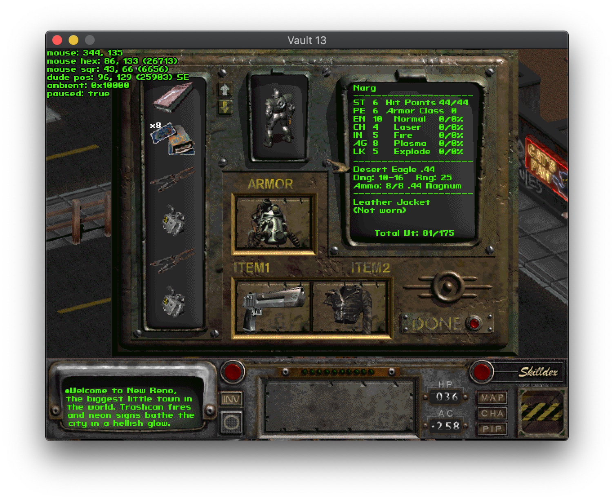

# Vault13


Reimplementation of Fallout 2 engine.

**This is a work in progress and is not playable**.

# Binaries

There's automated nightly build job that uploads development snapshot build as pre-releases on 
[Releases page](https://github.com/pingw33n/vault13/releases).

To run the downloaded binary on recent macOS versions it has to be explicitly allowed in Privacy & Security settings as
described [here](https://support.apple.com/en-gb/guide/mac-help/mchleab3a043/mac). That procedure
has to be done twice, once for the executable and once for the `libSDL2.dylib` library.

# Running demo

```
vault13 /path/to/fallout2 artemple
```

Controls that work in demo:

* Mouse
    * Left button to run/walk when in move mode (hex cursor). 
    * Right button to toggle move/pick mode.
* Arrows - scroll map.
* Hold `SHIFT` to walk instead of run.
* `[` and `]` - decrease/increase ambient light.
* `r` - toggle roof drawing.
* `` ` `` - toggle debug info display.
* `p` - toggle pause.



